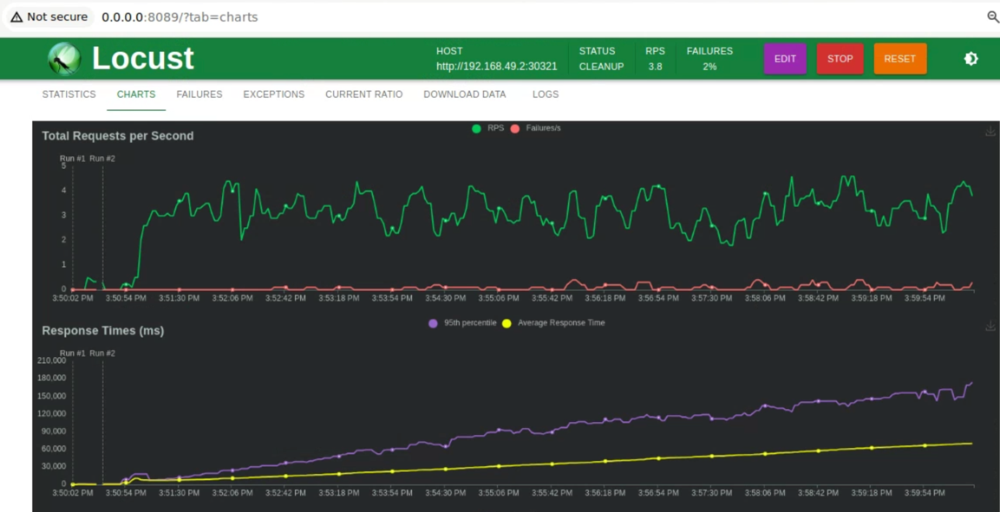

# Semantic Classification using Transformer and Deployment with FastAPI, Kubernetes, and AWS ECS Fargate + ALB

This project utilizes the all-MiniLM-L6-v2 model. This model maps sentences and paragraphs to a 384-dimensional dense vector space, making it suitable for tasks like clustering or semantic search. The project employs FastAPI to create an endpoint serving the transformer model.


Live endpoint AWS deployment [readme.md](deploy-aws%2Freadme.md)
#### Endpoint with single output
```
curl --location --request POST 'http://FastAP-FastA-LwNQPNCUV6mk-1271608237.us-east-2.elb.amazonaws.com/query' --header 'Content-Type: application/json' --data-raw '{"sentence": "feeling like a million bucks", "labels": ["happy", "sad", "rich"]}'
```
## Usage

The model takes a sentence `S` to be classified, along with labels `L = {l1, l2, ...}`, and returns the predicted label.

## Run locally

`docker-compose` is used to run locally.

### Start the API locally

```bash
$ docker-compose up
```

### Call the API
```bash
$ curl http://127.0.0.1:8002//query -X POST -d '{"sentence": "feeling like a million bucks", "labels": ["happy", "sad", "rich"]}' -H "Content-Type: application/json"
{
    "sentence": "feeling like a million bucks",
    "labels": ["happy", "sad", "rich"]
}
```
## Kubernetes deployment

    kubectl apply -f k8s/deployment.yaml

## Kubernetes Service
Creates a load balancer that exposes the service outside of the cluster.
    
    kubectl apply -f k8s/service.yaml

## HorizontalPodAutoscaler
To scale the deployment, apply a HorizontalPodAutoscaler.
Kubernetes will monitor the CPU usage of your pods, and if the CPU utilization exceeds the target average utilization (in this case, 50%), it will automatically scale up the number of pods up to the specified maximum replicas. Similarly, if the CPU utilization decreases, Kubernetes will scale down the number of pods accordingly
    

    kubectl apply -f k8s/autoscale.yaml
## Local testing with minikube
This command prints the URL to access the service
    
    minikube service fast-mimilm-lb --url

## Check Resource Metrics
    kubectl top pods


## Load testing
Use locust to simulate a high load on the API.
 It shows how the number of requests changes with the number of processes (users), and how these values impact the API speed. Thanks to kubernetes autoscale there is no bottleneck
```
pip install locust
locust -f locustfile.py
```
